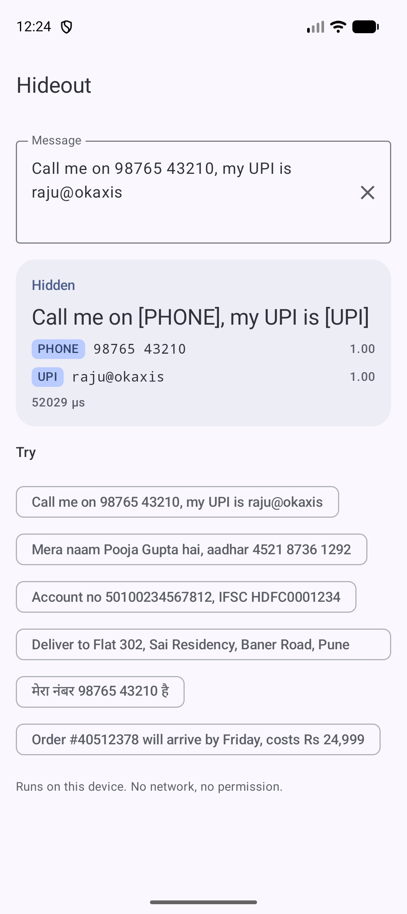
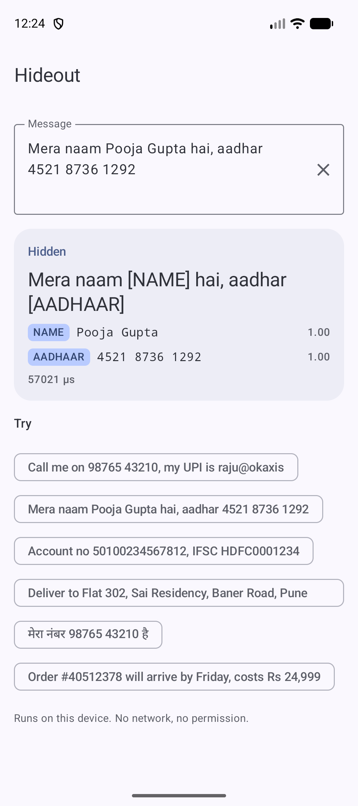
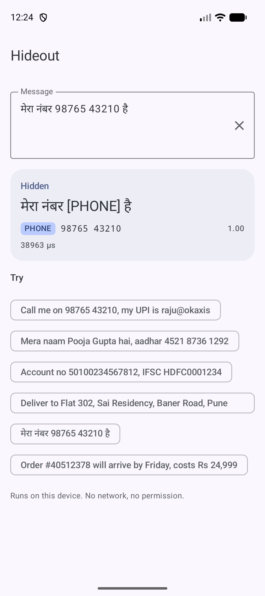
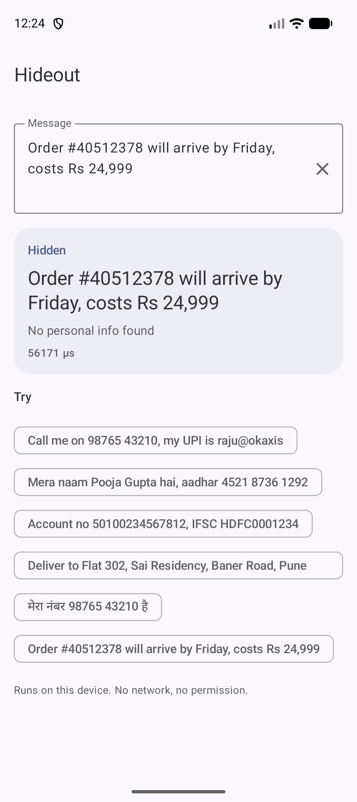

# Hideout 🏚️

By Hoverfly. On-device personal information detector for Android. It finds phone numbers, UPI IDs, Aadhaar, PAN,
card and bank numbers, emails, names, addresses and more in a message, and hides them before you save, show or send it.

```kotlin
import io.github.rajumark.hoverfly.hideout.Hideout

Hideout(context).use { hideout ->
    hideout.hide("Call me on 98765 43210, my UPI is raju@okaxis")
    // "Call me on [PHONE], my UPI is [UPI]"
    hideout.hide("Mera naam Pooja Gupta hai, aadhar 4521 8736 1292")
    // "Mera naam [NAME] hai, aadhar [AADHAAR]"
}
```

- **Made for Indian apps.** Indian phone formats, Aadhaar (also masked `XXXX XXXX 1234`), PAN, UPI IDs, IFSC, voter
  ID, driving licence and vehicle numbers, Indian addresses with PIN codes, and Indian names, in English, Hinglish,
  Hindi and other Indian languages. European languages work too.
- **19 kinds of personal info**, each with exact character offsets and a confidence score.
- **Leaves ordinary numbers alone.** Prices, times, order IDs, UPI transaction refs, PNRs and cities stay visible.
- **No dependencies.** Inference is plain Kotlin. There is no ONNX Runtime, TFLite, ML Kit or native code.
- **Private and offline.** The model ships inside the AAR. There is no network, no permission and no telemetry, so
  the text you are protecting never leaves the phone.
- **Small.** 8 MB of int8 weights. minSdk 21. Works from Kotlin and Java.

## Install

Available via [JitPack](https://jitpack.io/#rajumark/hideout):

```kotlin
// settings.gradle.kts
dependencyResolutionManagement {
    repositories {
        mavenCentral()
        maven { url = uri("https://jitpack.io") }
    }
}

// build.gradle.kts
dependencies {
    implementation("com.github.rajumark:hideout:v1.0.0")
}
```

## Screenshots

The sample app on an emulator. Every result is computed on the device.

| English | Hinglish | Hindi | Nothing to hide |
|---|---|---|---|
|  |  |  |  |
| "Call me on [PHONE], my UPI is [UPI]" | "Mera naam [NAME] hai, aadhar [AADHAAR]" | "मेरा नंबर [PHONE] है" | "Order #40512378 will arrive by Friday, costs Rs 24,999" |

## Use

```kotlin
val hideout = Hideout(context)       // loads the model: do it off the main thread, keep one instance

hideout.hide("Account no 50100234567812, IFSC HDFC0001234")
// "Account no [BANK_ACCOUNT], IFSC [IFSC]"

hideout.find("Call Rahul on 98765 43210")
// [Pii(type=NAME, start=5, end=10, text=Rahul, score=0.998),
//  Pii(type=PHONE, start=14, end=25, text=98765 43210, score=1.0)]

// only some kinds
hideout.hide("Call Rahul on 98765 43210", types = setOf(PiiType.PHONE))
// "Call Rahul on [PHONE]"

// your own replacement
hideout.hide("OTP is 482913", replacement = { "*".repeat(it.text.length) })
// "OTP is ******"

hideout.contains("thanks, see you on Monday")   // false

hideout.close()                       // frees the model's heap memory
```

`find()` and `hide()` are thread-safe. Long text is handled in overlapping windows, so every word gets context on both
sides. Offsets are UTF-16 indices, the same as `String.substring`.

With coroutines:

```kotlin
val hideout = withContext(Dispatchers.Default) { Hideout(context) }
val safe = withContext(Dispatchers.Default) { hideout.hide(message) }
```

From Java:

```java
try (Hideout hideout = new Hideout(context)) {
    String safe = hideout.hide("Call me on 98765 43210");
}
```

### API

| | |
|---|---|
| `Hideout(context)` | Loads the bundled model. `Closeable`. |
| `hide(text, types, threshold, replacement)` | The text with each found item replaced, by default `[TYPE]`. |
| `find(text, types, threshold)` | The found items: `Pii(type, start, end, text, score)`, in text order. |
| `contains(text, types, threshold)` | `true` if the text has personal info of those types. |
| `PiiType` | `NAME` `PHONE` `EMAIL` `UPI` `AADHAAR` `PAN` `CARD` `BANK_ACCOUNT` `IFSC` `ADDRESS` `PASSPORT` `VOTER_ID` `DRIVING_LICENSE` `VEHICLE` `GOV_ID` `DOB` `SECRET` `USERNAME` `IP` |

`threshold` (default 0.5) is how sure the model must be. Lower it to hide more (fewer leaks, more false alarms),
raise it to hide less. `SECRET` covers passwords, OTPs, PINs and CVVs. `ADDRESS` covers street, house or flat,
building and PIN code; a city on its own is not hidden. `DOB` is a date of birth; other dates are left alone.

## Quality

Measured on hand-written chat messages in 14 languages that were written after the model was trained and never used
to build or tune it, and on held-out test sets. "Hidden" = the whole item is covered; "left alone" = messages with no
personal info where nothing was hidden.

| | Hideout | Microsoft Presidio (Indian recognizers on) | GLiNER multi PII |
|---|---|---|---|
| Fresh hand-written messages: PII hidden | **96%** | 64% | 42% |
| Fresh hand-written messages: no-PII messages left alone | **95%** | 40% | 90% |
| Fresh hand-written messages: exactly right | **90%** | 37% | 47% |
| Indian chat (3,000 messages): PII hidden | **99%** | 66% | 62% |
| Multilingual PII benchmark (8 languages): PII hidden | **98%** | 58% | 40% |
| English documents benchmark: PII hidden | **98%** | 71% | 76% |
| Size | **8 MB** | 445 MB | 1.1 GB |
| Latency, one message, 1 CPU thread (laptop) | **~0.3 ms** | ~10 ms | ~66 ms |

**Where it falls short:** a name right before a relation word is sometimes missed ("Hemant bhai"); a bare number
after "at" can be hidden as an address ("starts at 7"); Wi-Fi network names can be taken as passwords; a word next to
a found item is sometimes swallowed into it ("flat B-1102 …"). Chinese, Japanese and Thai are not supported.

## Sample app

`sample/` is a Jetpack Compose (Material 3) demo: type or pick a message and see it hidden, with each found item, its
type, its score and the time it took.

```bash
./gradlew :sample:installDebug
```

## Project layout

```
hideout/              the library (AAR)
  src/main/assets/hideout/          hideout.bin (int8 weights) · spm_pieces.tsv (tokenizer)
  src/main/kotlin/io/github/rajumark/hoverfly/hideout/           public API: Hideout, PiiType, Pii
  src/main/kotlin/io/github/rajumark/hoverfly/hideout/internal/  Text, Featurizer, SentencePiece, Network (the model in plain Kotlin)
  src/test/           JVM tests: parity with the reference on 197 vectors, API, long text, latency
  src/androidTest/    the same parity check on a real device (Android ICU)
sample/               demo app
```

## Tests

```bash
./gradlew :hideout:testDebugUnitTest                      # JVM: parity + API
./gradlew :hideout:connectedDebugAndroidTest              # on a connected device/emulator
```

The parity tests require identical units, token ids, labels and hidden text as the reference implementation on all
197 vectors (JVM and emulator).

## How it works

Text is cut into units at every letter / digit / symbol boundary, so a found item maps back to exact characters
(`raju@okaxis,` gives `raju@okaxis`). Each unit is split into SentencePiece tokens; each token also carries a hash of
its whole unit and its shape (case, script, number of digits, the symbol itself, whether a space comes before it). A
small bidirectional transformer (4 layers, 7M parameters, int8 weights with one scale per row) labels every unit as the
start or inside of one of 19 types, or nothing. Long text is cut into overlapping windows of 128 tokens.

## Publishing

See [PUBLISHING.md](PUBLISHING.md).

## Pricing & license

**Free for up to 10,000 monthly active devices.** You don't need an API key, an account or a license file: add the dependency and ship. It works in commercial apps too, with no limit on how often each device runs it.

| | Community | Commercial | Custom models |
|---|---|---|---|
| **Price** | Free | Contact us | Contact us |
| **For** | Products with up to 10,000 monthly active devices per platform | Products above 10,000 monthly active devices on any platform | A model trained for your own language, domain or task |
| **Includes** | Commercial use, unlimited calls, no key or sign-up | One license per product per model, direct support, early access to updates | Designed and trained by Hoverfly, shipped as a plain Kotlin library |

**How devices are counted.** A monthly active device is a device that runs Hideout at least once in a calendar month. The limit applies separately to each product, each platform (Android, iOS, web…) and each Hoverfly model. Once a product passes it, you have 30 days to get a commercial license. The library keeps working and never checks in with a server.

**Not allowed** under any tier (unless agreed in writing):

- selling or redistributing Hideout or its model on its own, or inside another SDK or library
- extracting, modifying, fine-tuning or retraining the model weights
- using the model or its outputs to train or distill another model
- reverse engineering the model or its file format
- offering it as a hosted API for others

**Custom models.** Hoverfly also designs and trains small, fast on-device models for your needs: privacy filters, moderation, classification, language detection, smart replies and more.

**Contact** for a commercial license or a custom model: [raju348636@gmail.com](mailto:raju348636@gmail.com) or **+91 63533 21951** (call or WhatsApp).

Full terms: [Hoverfly Community License](LICENSE).
